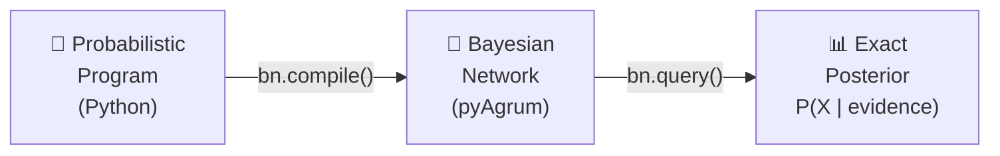
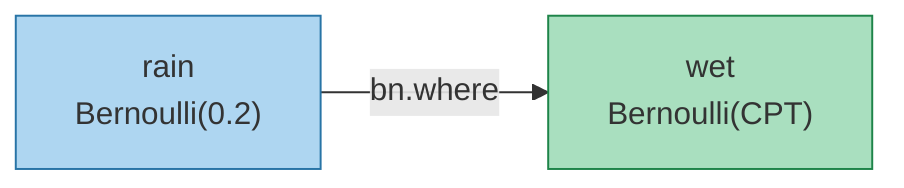
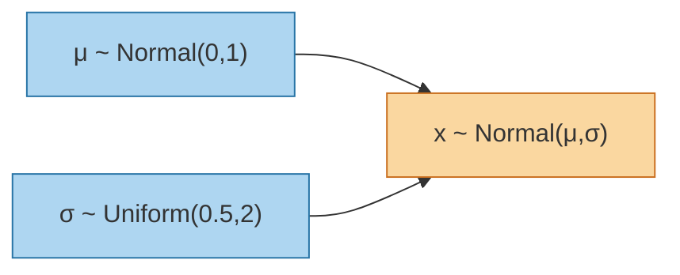
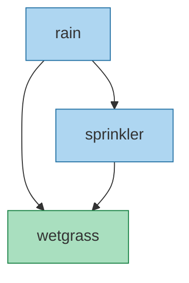
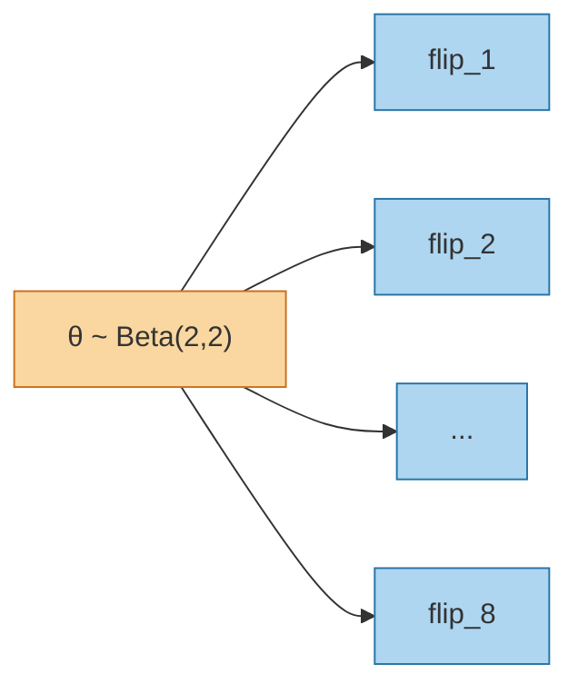
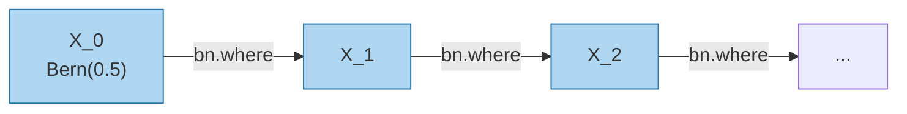

# Bnpyro

**Bnpyro** is a Python library that compiles higher-order probabilistic programs into exact Bayesian Networks (BNs). It uses [pyAgrum](https://agrum.gitlab.io/) for BN structure and inference, and is based on the formal framework of the **λ!-calculus** from:

> Faggian, Pautasso & Vanoni — *Higher-Order Bayesian Networks, Exactly* (POPL 2024)
> DOI: [10.1145/3632919](https://doi.org/10.1145/3632919)

Instead of approximate Monte Carlo inference (as in Pyro/Stan), Bnpyro compiles the program into a BN and performs **exact inference** via Variable Elimination.

---

## How it works



Each `bn.sample(...)` call becomes a BN node; each distribution becomes a CPT; `bn.compile()` wires everything together.

### Example: Rain -> Wet

```python
bn   = BNppl()
rain = bn.sample("rain", Bernoulli(0.2))
wet  = bn.sample("wet",  bn.where(rain, 0.9, 0.01))
bn.compile()

p = bn.query("rain", evidence={"wet": True})
# {'False': 0.054, 'True': 0.946}
```



---

## Features

| Bnpyro construct | λ!-calculus | Description |
|---|---|---|
| `bn.sample("x", dist)` | `let x = sample_d` | Declare a random variable |
| `bn.sample("x", bn.where(pa, ...))` | `case⟨pa⟩` | Conditional Bernoulli CPT |
| `bn.sample("x", lambda p: dist, parents=[p])` | extension | Universal lambda (any parent type) |
| `bn.plate("f", dist)` / `f()` | `!t` / `der` | Freeze / instantiate a reusable distribution |
| `bn.recurse("x", fn, N)` | `fix f N` | Bounded recursion / Markov chains |
| Python HOF over `BNNode`/`BNThunk` | `λx.t` | Higher-order functions |
| `bn.query(target, evidence)` | VE | Exact posterior inference |

---

## Installation

```bash
pip install pyagrum scipy matplotlib
```

Clone or copy `Bnpyro.py` and `distributions.py` into your project.

---

## Quick Start

```python
from Bnpyro import BNppl
from distributions import Normal, Uniform

bn    = BNppl(n_bins=15)
mu    = bn.sample("mu",    Normal(0.0, 1.0))
sigma = bn.sample("sigma", Uniform(0.5, 2.0))
x     = bn.sample("x", lambda m, s: Normal(m, s), parents=[mu, sigma])
bn.compile()
# BN compiled: 3 nodes, 2 arcs, 3375 CPT entries (0.027 MB)

p = bn.query("mu", evidence={"x": 5})   # P(μ | X in bin containing 5)
```



---

## Notebooks

| Notebook | Content |
|---|---|
| [`Bnpyro_Tutorial.ipynb`](Bnpyro_Tutorial.ipynb) | 8 worked examples (discrete, continuous, plates, recursion, HOF) |
| [`Discretization.ipynb`](Discretization.ipynb) | Deep dive into discretization: n_bins, MIDPOINT vs INTEGRATION, CPT explosion, BIN_ADAPTIVE, memory limits |
| [`Pyro_vs_Bnpyro.ipynb`](Pyro_vs_Bnpyro.ipynb) | Side-by-side comparison with Pyro: discrete BN, plates/thunks, continuous MCMC vs exact BN |
| [`recurse_examples.ipynb`](recurse_examples.ipynb) | Examples using `bn.recurse` for dynamic Bayesian networks |

### Tutorial examples (`Bnpyro_Tutorial.ipynb`)

1. **Classic BN** — Rain -> Wet, exact posterior
2. **Thunk (`!t` / `der`)** — Shared biased coin, belief update
3. **Discretization strategies** — `BIN_UNIFORM` vs `BIN_ADAPTIVE`, CPT size comparison
4. **Template BN (plate)** — N students sharing the same structure
5. **Universal lambda** — Continuous -> Bernoulli, Continuous -> Continuous, Categorical -> Continuous
6. **Multi-parent discrete** — WetGrass CPT with nested `bn.where`
7. **Recursion (`fix`)** — Bernoulli Markov chain + Gaussian random walk
8. **Higher-order functions** — Parametric thunk, `apply_n`, reusable sensor constructor

---

## API Reference

### `BNppl(...)`

```python
BNppl(
    n_bins=10,                        # bins for continuous variables
    discretization_method=MIDPOINT,   # MIDPOINT | INTEGRATION
    bin_strategy=BIN_UNIFORM,         # BIN_UNIFORM | BIN_ADAPTIVE
    memory_warn_mb=50.0,              # warn if CPT total exceeds threshold
    memory_limit_mb=None,             # abort compile if exceeded
)
```

| Method | Returns | Description |
|---|---|---|
| `bn.sample(name, dist_or_cpt, parents=None, n_bins=None)` | `BNNode` | Add a random variable node |
| `bn.where(condition, p_true, p_false)` | `_BernoulliCPT` | Conditional CPT (nestable for multi-parent) |
| `bn.plate(name, dist_or_fn, parents=None)` | `BNPlate` | Thunk: each call creates an independent node |
| `bn.recurse(name, step_fn, n_steps)` | `list[BNNode]` | Unroll a recursive program |
| `bn.compile()` | — | Build and check the BN |
| `bn.query(target, evidence)` | `dict` | Exact posterior: `{label: prob}` |
| `bn.show()` | — | Print BN summary |
| `bn.show_graph()` | — | Visualize BN in template notation |
| `bn.gum_bn` | `gum.BayesNet` | Access the underlying pyAgrum BN |

### Supported distributions (`distributions.py`)

`Bernoulli`, `Categorical`, `Normal`, `Beta`, `Gamma`, `Uniform`, `Exponential`, `LogNormal`

---

## Discretization

Continuous variables are approximated by a discrete histogram over `n_bins` equal-width intervals.

### Bin strategies

| Strategy | Behaviour | When to use |
|---|---|---|
| `BIN_UNIFORM` | All nodes get `n_bins` | Default — full precision everywhere |
| `BIN_ADAPTIVE` | Fewer bins for nodes with many parents (k=2 -> `n_bins//2`, k≥3 -> `max(3, n_bins//4)`) | Avoid CPT explosion with many parents |

### Discretization methods (for conditional nodes)

| Method | How | When better |
|---|---|---|
| `MIDPOINT` | Evaluates CPT at parent bin center | Linear relationships |
| `INTEGRATION` | Integrates CPT over parent bin (uniform) | Non-linear relationships (Jensen's inequality) |

### CPT size

$$\text{CPT entries} = n\_bins^{k+1}$$

where k = number of continuous parents. Use `BIN_ADAPTIVE` or per-node override `bn.sample(..., n_bins=5)` to keep this manageable.

### Memory protection

```python
bn = BNppl(n_bins=20, memory_warn_mb=10.0, memory_limit_mb=100.0)
```

- `memory_warn_mb`: prints a warning + per-node breakdown if total CPT exceeds threshold
- `memory_limit_mb`: raises `RuntimeError` and aborts compilation if exceeded

### Recommended `n_bins`

| Continuous parents k | Recommended `n_bins` |
|---|---|
| 0 — root node | 15 – 30 |
| 1 | 10 – 15 |
| 2 | 8 – 10 |
| 3+ | use `BIN_ADAPTIVE` |

---

## Advanced patterns

### Nested `bn.where` for multi-parent CPT

```python
# WetGrass depends on Rain AND Sprinkler
wetgrass = bn.sample("wetgrass", bn.where(rain,
    bn.where(sprinkler, 0.99, 0.90),   # rain=T: P(wet | spr=T/F)
    bn.where(sprinkler, 0.90, 0.01)    # rain=F: P(wet | spr=T/F)
))
```



### Plate (thunk) — N i.i.d. observations

```python
theta = bn.sample("theta", Beta(2.0, 2.0))
coin  = bn.plate("flip", lambda t: Bernoulli(t), parents=[theta])
flips = [coin() for _ in range(8)]   # flip_1 .. flip_8
```



### Temporal model (DBN via `recurse`)

```python
states = bn.recurse("X",
    lambda i, prev: Bernoulli(0.5) if prev is None
                    else bn.where(prev, 0.9, 0.1),
    n_steps=5
)
```



### Access all pyAgrum tools

```python
import pyagrum as gum
import pyagrum.lib.notebook as gnb

gnb.showBN(bn.gum_bn)              # visual graph in notebook
ie = gum.VariableElimination(bn.gum_bn)
```

---

## Project structure

```
Bnpyro.py                  # Main library
distributions.py           # Lightweight distribution classes (Normal, Beta, ...)
Bnpyro_Tutorial.ipynb      # 8 worked examples
Discretization.ipynb       # Discretization deep dive
Pyro_vs_Bnpyro.ipynb       # Comparison with Pyro (discrete, plates, continuous)
recurse_examples.ipynb     # Recursion / DBN examples
```

---

## References

- Faggian C., Pautasso D., Vanoni G. — *Higher-Order Bayesian Networks, Exactly*, POPL 2024
- Gonzales C., Wuillemin P.-H. — *pyAgrum*, 2020 — https://agrum.gitlab.io/
- Bingham et al. — *Pyro: Deep Universal Probabilistic Programming*, JMLR 2019
